# Notification Command Handling Flowchart

```mermaid
    flowchart
    A[Start: handleNotificationCommand] --> B{Is command null?}
    B -- Yes --> C[Log warning: Null notification command received] --> Z[End]
    
    B -- No --> D[Validate and enrich command]
    
    %% New flow for validateAndEnrichCommand
    D --> D1{Subscribers or contact details available?}
    D1 -- No --> D2[Throw NotAllowedException: Command must have subscribers or contact details] --> Z[End]
    D1 -- Yes --> D3{OrgId present?}
    D3 -- No --> D4[Throw NotAllowedException: Command must have orgId] --> Z[End]
    D3 -- Yes --> D5[Set empty lists for missing fields] --> D6[Map to supported channels]
    
    D6 --> D7{Debounce time <= 0?}
    D7 -- Yes --> D8[Throw NotAllowedException: Negative debounce time not allowed] --> Z[End]
    D7 -- No --> D9[Set createdOn timestamp if null]
    
    D9 --> D10[Set SMS, Email, WhatsApp quotas to false if null]
    D10 --> D11[Map to supported user types]
    D11 --> D12{UUID present?}
    D12 -- No --> D13[Generate new UUID for command]
    D12 -- Yes --> D14[Validate channels with channelValidationSvc]
    
    D14 --> D15{Debounce time available?}
    D15 -- Yes --> D16[Set schedule time based on debounce time]
    D15 -- No --> D17[Proceed with current schedule time]
    
    D16 --> D18[Validate contact details]
    D17 --> D18[Validate contact details]
    
    %% Expanded Validate Contact Details
    D18 --> E1{Channels include WhatsApp?}
    E1 -- Yes --> E2[Split WhatsApp and other channels]
    E2 --> E3[Generate unique WhatsApp commands per subscriber]
    E3 --> E4[Check user type: Transporter?]
    E4 -- Yes --> E5[Fetch Transporter details, validate mobile numbers]
    E4 -- No --> E6[Fetch User contact details, validate mobile numbers]
    
    E5 --> E7{Mobile number present?}
    E7 -- Yes --> E8[Add new command with unique mobile number]
    E7 -- No --> E9[Log info: Phone number not found for transporter]
    E8 --> E10[Add command to list]
    E9 --> E10[Add command to list]
    
    E6 --> E11{Mobile number present?}
    E11 -- Yes --> E12[Add new command with unique mobile number]
    E11 -- No --> E13[Log info: Mobile number not found for subscriber]
    E12 --> E10[Add command to list]
    E13 --> E10[Add command to list]
    
    E10 --> F[Handle empty channels and synchronize details]
    
    %% Handle Empty Channels and Synchronize Details
    F --> F1{Channels empty?}
    F1 -- Yes --> G[Return commands list]
    F1 -- No --> F2{UserType User?}
    F2 -- Yes --> F3{Channels include Email?}
    F3 -- Yes --> F4[Validate email IDs with user IDs]
    F3 -- No --> F4[Skip email validation]
    
    F2 -- No --> F4[Skip email validation]
    
    F4 --> F5{Channels include SMS or WhatsApp?}
    F5 -- Yes --> F6[Validate mobile numbers with user IDs]
    F5 -- No --> F6[Skip mobile number validation]
    
    F6 --> F7{Channels include Email and SMS?}
    F7 -- Yes --> F8[Check synchronization of email IDs, mobile numbers, and subscriber IDs]
    F7 -- No --> F8[Skip synchronization check]
    
    F8 --> F9{Channels include WhatsApp?}
    F9 -- Yes --> F10[Check synchronization of mobile numbers and subscriber IDs for WhatsApp]
    F9 -- No --> F11[Proceed with command]
    
    F10 --> F12[Throw NotAllowedException if mismatch]
    F11 --> F13[Add command to list]
    F12 --> F13[Add command to list]
    
    F13 --> G[Return commands list]
    
    %% Continue original flow
    G --> H[Get events related to command UUID]
    H --> I{Events list is null?}
    I -- Yes --> J[Throw NotAllowedException: Error getting events]
    
    I -- No --> K{Events list is empty?}
    K -- Yes --> L[Handle new command]
    K -- No --> M[Handle old command]
    
    %% Handle New Command Section
    L --> N[Check debounce time in handleNewCommand]
    N --> O{Debounce time > 0?}
    
    %% Handle New Command With Debounce
    O -- Yes --> P[Call handleNewCommandWithDebounce]
    P --> P1[Log command details and quotas]
    P1 --> P2{All quotas over?}
    P2 -- Yes --> P3[Set status to SKIPPED and save command]
    P2 -- No --> P4[Set status to QUEUED and save command]
    
    P3 --> P5[Map command to events]
    P4 --> P5[Map command to events]
    P5 --> P6[Produce events for the command] --> Z[End]
    
    %% Handle New Command Without Debounce
    O -- No --> Q[Call handleNewCommandWithoutDebounce]
    Q --> Q1[Validate quota limits and remove throttled channels]
    Q1 --> Q2[Map command to events]
    Q2 --> Q3[Produce events for the command]
    
    Q3 --> Q4{All quotas over?}
    Q4 -- Yes --> Q5[Set status to SKIPPED and save command] --> Z[End]
    Q4 -- No --> Q6[Send messages to available channels] --> Z[End]
    
    %% Remove Throttled Channels Section
    Q1 --> T1[Check throttling for Email]
    T1 --> T2{Is Email throttled?}
    T2 -- Yes --> T3[Send warning notification for throttled Email] --> T4[Remove Email from command channels]
    T2 -- No --> T5[Proceed with Email]
    
    T4 --> T6[Update command channels]
    
    T5 --> T6
    
    T6 --> T7[Check throttling for SMS]
    T7 --> T8{Is SMS throttled?}
    T8 -- Yes --> T9[Send warning notification for throttled SMS] --> T10[Remove SMS from command channels]
    T8 -- No --> T11[Proceed with SMS]
    
    T10 --> T12[Update command channels]
    T11 --> T12
    
    T12 --> T13[Check throttling for WhatsApp]
    T13 --> T14{Is WhatsApp throttled?}
    T14 -- Yes --> T15[Send warning notification for throttled WhatsApp] --> T16[Remove WhatsApp from command channels]
    T14 -- No --> T17[Proceed with WhatsApp]
    
    T16 --> T18[Update command channels]
    T17 --> T18[Return updated command]
    
    %% Handle Old Command Section
    M --> R[Validate quota limits in handleOldCommand]
    R --> S[Remove throttled channels]
    S --> T[Process events from debounced command]
    T --> U{Any subscribers left?}
    U -- No --> V[Log: All subscribers read push notification] --> Z[End]
    
    U -- Yes --> W{Command status is SKIPPED?}
    W -- Yes --> X[Reproduce command]
    W -- No --> Y[Send messages to available channels]
    
    X --> Y
    Y --> Z[End]
```

This flowchart details the end-to-end process of handling a notification command, including validating and enriching the command, handling contact details, managing channels, and processing new or old commands.
