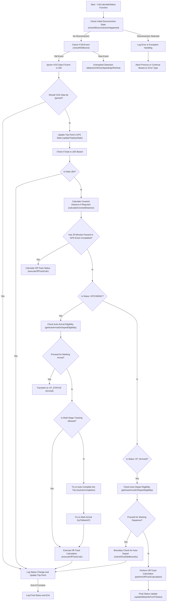

```mermaid
  flowchart
    A1["Start - Call calculateStatus Function"] --> A2["Check Initial Disconnection State (checkIfDisconnectionHappened)"]
    
    A2 -->|No Disconnection| A3["Check if Old Event (checkIfOldEvent)"]
    A2 -->|Disconnection Detected| B1["Log Error or Exception Handling"] --> B2["Abort Process or Continue Based on Error Type"]
    
    A3 -->|Old Event| A5["Ignore VGS Data if Event is Old"]
    A3 -->|New Event| A4["Overspeed Detection (detectionOfOverSpeedingOfVehicle"]
    
    A5 --> A6{"Should VGS Data be Ignored?"}
    A6 --Yes--> A28["Log Status Change and Update Trip Point"]
    A6 --No--> A7["Update Trip Point's GPS State (updateTripGpsState)"]
    
    A7 --> A8["Check If Data is LBS Based"]
    A8 --> A9{"Is Data LBS?"}
    A9 --Yes--> A28
    A9 --No--> A10["Calculate Covered Distance if Required (calculateCoveredDistance)"]

    A10 --> A11{"Has 30 Minutes Passed or GPS Event Completed?"}
    A11 --Yes--> A12["Calculate Off-Track Status (executeOffTrackCalc)"]
    A11 --No--> A13{"Is Status 'UPCOMING'?"}
    
    %% UPCOMING_STATUS Flow
    A13 --Yes--> A14["Check Auto Arrival Eligibility (getAutoArrivalOrDepartEligibility)"]
    A14 --> A15{"Proceed for Marking Arrival?"}
    A15 --Yes--> A26["Transition to 'AT_STATUS' (Arrived)"]
    A15 --No--> A16{"Is Multi-Stage Tracking Allowed?"}
    
    A16 --Yes--> A19["Execute Off-Track Calculation (executeOffTrackCalc)"]
    A16 --No--> A17["Try to Auto-Complete the Trip (tryAutoCompletion)"]
    
    A17 --> A18["Try to Mark Arrival (tryToMarkAT)"]
    A18 --> A19
    A19 --> A28
    
    %% AT_STATUS Flow
    A13 --No--> A20{"Is Status 'AT' (Arrived)?"}
    A20 --Yes--> A21["Check Auto Depart Eligibility (getAutoArrivalOrDepartEligibility)"]
    A21 --> A22{"Proceed for Marking Departure?"}
    
    A22 --Yes--> A24["Boundary Check for Auto-Depart (checkIfOutSideBoundry)"]
    A22 --No--> A23["Perform Off-Track Calculation (performOffTrackCalculation)"]
    
    A23 --> A25["Final Status Update (updateMetaInfoForATStatus)"]
    A24 --> A28
    
    A28 -->|End of Function| B3["Log Final Status and Exit"]
```
